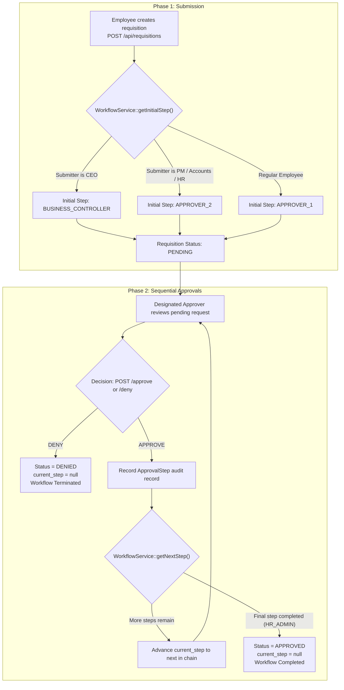

# Requisition Management System API

[](https://www.php.net/)
[](https://laravel.com/)
[](https://laravel.com/docs/sanctum)
[](#running-tests)
[](docs/wiki/Home.md)

A robust, enterprise-grade RESTful API for organizational requisition and purchase management built with **Laravel**. The system streamlines the entire requisition lifecycle—from item submission, automatic pricing calculations, and sequential multi-tier approvals, to financial verification and audit logging.

---

## Key Features

- **Dynamic 5-Tier Approval Workflow**: Automatic progression through `APPROVER_1` (PM) ➔ `APPROVER_2` (CEO) ➔ `BUSINESS_CONTROLLER` ➔ `ACCOUNTS` ➔ `HR_ADMIN`.
- **Role-Aware Starting Steps**: Smart workflow initialization that dynamically selects the starting stage based on the submitter's organizational role (e.g. CEO submissions jump straight to Business Controller).
- **Clean Architecture & Domain Services**: Clear separation of concerns with thin controllers, dedicated domain service classes ([`WorkflowService`](file:///home/zero/Documents/pc/requisition-api/app/Services/WorkflowService.php), [`RequisitionService`](file:///home/zero/Documents/pc/requisition-api/app/Services/RequisitionService.php), [`SettingsService`](file:///home/zero/Documents/pc/requisition-api/app/Services/SettingsService.php)), and custom form requests.
- **Granular Policy Authorization**: Comprehensive Gate/Policy protection across all actions and auto-scoped query filtering for pending reviews.
- **Full Audit Trail**: Every approval and denial action is immutably logged with timestamp, reviewer ID, stage type, decision, and remarks.
- **Structured JSON API Resources**: Predictable, clean API payloads using Laravel API Resource transformations.
- **Soft Deletes**: Data preservation across users and requisitions with soft deletion support.

---

## Workflow & Architecture Overview



---

## Technology Stack

- **Backend Framework**: [Laravel](https://laravel.com) (PHP 8.4+)
- **Authentication**: [Laravel Sanctum](https://laravel.com/docs/sanctum) (Bearer Token)
- **Database**: SQLite (Development/Testing) / MySQL / PostgreSQL (Production)
- **Code Standards**: [Laravel Pint](https://laravel.com/docs/pint) (PSR-12 / Laravel standard)
- **Testing**: PHPUnit & Mockery

---

## Quick Start

### 1. Prerequisites
- **PHP** `>= 8.4`
- **Composer** `>= 2.5`

### 2. Installation & Setup

```bash
# Clone the repository
git clone <repository-url>
cd requisition-api

# Install Composer dependencies
composer install

# Configure environment file
cp .env.example .env
php artisan key:generate

# Run migrations and seed default Super Admin
php artisan migrate --seed

# Start the local development server
php artisan serve
```

The API will be available at `http://127.0.0.1:8000`.

---

## Default Seeded Credentials

Running `php artisan db:seed` provisions the initial administrator:

| Attribute | Value |
| :--- | :--- |
| **Email** | `admin@company.com` |
| **Password** | `password123` |
| **Role** | `SUPER_ADMIN` |
| **Employee ID** | `EMP-0001` |
| **Designation** | `Super Administrator` |

---

## API Endpoint Reference

### Authentication
| Method | Endpoint | Access | Description |
| :--- | :--- | :--- | :--- |
| `POST` | `/api/login` | Public | Authenticate and obtain Sanctum Bearer token |
| `GET` | `/api/user` | Authenticated | Get current authenticated user profile |
| `POST` | `/api/logout` | Authenticated | Revoke current access token |

### User Management
| Method | Endpoint | Access | Description |
| :--- | :--- | :--- | :--- |
| `GET` | `/api/users` | `SUPER_ADMIN`, `HR_ADMIN` | List and paginate users |
| `POST` | `/api/users` | `SUPER_ADMIN`, `HR_ADMIN` | Create a new user account |
| `GET` | `/api/users/{id}` | Admin / HR / Self | View user profile details |
| `PUT` | `/api/users/{id}` | `SUPER_ADMIN`, `HR_ADMIN` | Update user details or role |
| `DELETE` | `/api/users/{id}` | `SUPER_ADMIN` | Soft-delete a user account |

### System Settings (Approver Assignments)
| Method | Endpoint | Access | Description |
| :--- | :--- | :--- | :--- |
| `GET` | `/api/settings` | `SUPER_ADMIN` | Fetch current designated approvers |
| `PUT` | `/api/settings` | `SUPER_ADMIN` | Update designated approver user IDs |

### Requisitions & Approvals
| Method | Endpoint | Access | Description |
| :--- | :--- | :--- | :--- |
| `GET` | `/api/requisitions` | Authenticated | List requisitions (auto-scoped by role and step) |
| `POST` | `/api/requisitions` | Authenticated | Create a requisition with line items |
| `GET` | `/api/requisitions/{id}` | Submitter / Approver / Admin | View full requisition details & audit log |
| `PUT` | `/api/requisitions/{id}` | Submitter (before approvals) | Update requisition line items & totals |
| `DELETE` | `/api/requisitions/{id}` | Submitter (while pending) | Soft-delete a requisition |
| `POST` | `/api/requisitions/{id}/approve` | Designated Approver | Approve requisition and advance workflow |
| `POST` | `/api/requisitions/{id}/deny` | Designated Approver | Deny requisition and terminate workflow |

---

## Project Wiki & Documentation

Detailed technical documentation and developer guides are available in the [`docs/wiki`](docs/wiki/Home.md) directory:

-  [01 — Architecture & System Design](docs/wiki/01-Architecture-and-Design.md)
-  [02 — Domain Model & Database Architecture](docs/wiki/02-Domain-Model-and-Database.md)
-  [03 — Authentication & Authorization Policies](docs/wiki/03-Authentication-and-Authorization.md)
-  [04 — Requisition & Approval Workflow Engine](docs/wiki/04-Requisition-and-Approval-Workflow.md)
-  [05 — API Reference & JSON Payloads](docs/wiki/05-API-Reference-and-Examples.md)
-  [06 — Development, Testing & Operations](docs/wiki/06-Development-Testing-and-Operations.md)
-  [Consolidated System Flow](docs/SYSTEM_FLOW.md)

---

## Running Tests & Quality Checks

```bash
# Run PHPUnit test suite
php artisan test

# Format codebase using Laravel Pint
./vendor/bin/pint

# Check coding standards without changing files
./vendor/bin/pint --test
```

---

## License

This software is open-sourced under the [MIT License](LICENSE).
