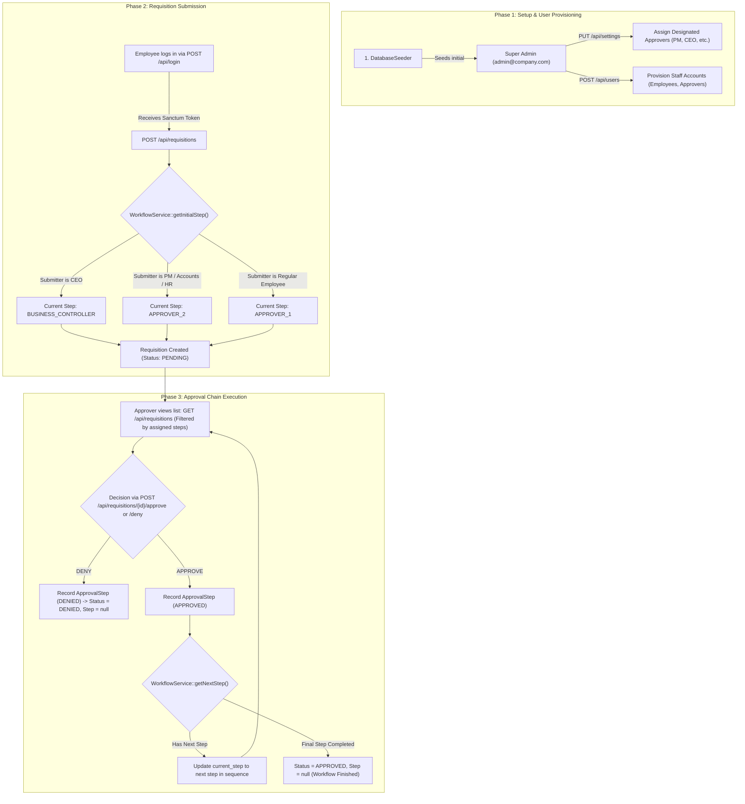

# Requisition API — Complete System Flow & Architectural Specification

## 1. System Architecture Overview

The application is structured following Clean Architecture and SOLID principles. HTTP transport, authorization, domain business logic, data persistence, and serialization are decoupled into distinct layers.

```
┌─────────────────────────────────────────────────────────────────────────┐
│                           HTTP CLIENT (React / UI)                      │
└────────────────────────────────────┬────────────────────────────────────┘
                                     │ Bearer Token
                                     ▼
┌─────────────────────────────────────────────────────────────────────────┐
│                    AUTHENTICATION GUARD (Sanctum)                       │
│      Validates Bearer token & populates authenticated user context      │
└────────────────────────────────────┬────────────────────────────────────┘
                                     │
                                     ▼
┌─────────────────────────────────────────────────────────────────────────┐
│                         ROUTING & MIDDLEWARE                            │
│                  (routes/api.php + Form Requests)                       │
│    • Validation: StoreRequisitionRequest, UpdateUserRequest, etc.       │
└────────────────────────────────────┬────────────────────────────────────┘
                                     │
                                     ▼
┌─────────────────────────────────────────────────────────────────────────┐
│                             CONTROLLERS                                 │
│  (AuthController, UserController, RequisitionController, etc.)          │
│    • Gate Authorizations (RequisitionPolicy, UserPolicy, etc.)         │
└────────────────────────────────────┬────────────────────────────────────┘
                                     │
                                     ▼
┌─────────────────────────────────────────────────────────────────────────┐
│                           DOMAIN SERVICES                               │
│  • AuthService: Credentials check & token generation                    │
│  • RequisitionService: Calculations, item persistence, atomic updates   │
│  • WorkflowService: Initial step resolution & approval state transitions│
│  • SettingsService: Singleton settings cache & approver resolution     │
│  • RequisitionNumberService: Unique sequence code generation            │
└────────────────────────────────────┬────────────────────────────────────┘
                                     │
                                     ▼
┌─────────────────────────────────────────────────────────────────────────┐
│                     DATABASE / ELOQUENT MODELS                          │
│  (User, Requisition, RequisitionItem, ApprovalStep, SystemSettings)     │
└────────────────────────────────────┬────────────────────────────────────┘
                                     │
                                     ▼
┌─────────────────────────────────────────────────────────────────────────┐
│                         API JSON RESOURCES                              │
│  (UserResource, RequisitionResource, SystemSettingsResource)            │
└─────────────────────────────────────────────────────────────────────────┘
```

---

## 2. User Roles & Workflow Hierarchy

### User Types (`UserType` Enum)
* `SUPER_ADMIN`: Full system access, configures approver roles, manages users.
* `HR_ADMIN`: Manages employees, acts as the final stage (`HR_ADMIN`) approver.
* `ACCOUNTS`: Handles financial verification (`ACCOUNTS` step).
* `EMPLOYEE`: Standard team member, submits requisitions.

### Designated System Approvers (`SystemSettings`)
The approval chain is dynamically assigned via `SystemSettings`:
1. **First Approver (`APPROVER_1`)**: Project Manager / Team Lead.
2. **Second Approver (`APPROVER_2`)**: CEO / Managing Director.
3. **Business Controller (`BUSINESS_CONTROLLER`)**: Finance & Procurement Controller.
4. **Accounts Approver (`ACCOUNTS`)**: Accounts Department.
5. **HR Admin Approver (`HR_ADMIN`)**: HR Department (Final Step).

---

## 3. End-to-End Lifecycle & Workflow Flowchart



---

## 4. Step-by-Step Execution Lifecycle

### Phase 1: Bootstrap & Approver Assignment
1. **Initial Admin Setup**: `php artisan db:seed` provisions `admin@company.com` (`password123`).
2. **Super Admin Login**: Admin calls `POST /api/login` and receives a Sanctum Bearer token.
3. **Assign Approver Roles**: Admin calls `PUT /api/settings` specifying the user IDs for:
   * `first_approver_user_id` (PM)
   * `second_approver_user_id` (CEO)
   * `business_controller_user_id`
   * `accounts_approver_user_id`
   * `hr_admin_approver_user_id`
4. **Provision Staff**: Admin / HR calls `POST /api/users` to create employee accounts with specific roles.

---

### Phase 2: Submitting a Requisition
1. **Employee Login**: Employee calls `POST /api/login` with their credentials.
2. **Create Requisition**: Employee sends `POST /api/requisitions` with line items (`item_name`, `quantity`, `unit_price`, `description`).
3. **Automated Processing ([`RequisitionService`](file:///home/zero/Documents/pc/requisition-api/app/Services/RequisitionService.php))**:
   * Calculates `total_price` per line item and sums `total_expected_price`.
   * Generates a unique sequence code (e.g. `REQ-2026-0001`).
   * Evaluates submitter role via [`WorkflowService::getInitialStep()`](file:///home/zero/Documents/pc/requisition-api/app/Services/WorkflowService.php#L19) to set starting workflow step.
   * Atomically saves the requisition and items inside a DB transaction.

---

### Phase 3: Multi-Stage Approval Chain
1. **Viewing Pending Requisitions**:
   * Calling `GET /api/requisitions` automatically filters results based on the logged-in user's active approval responsibilities.
   * `SUPER_ADMIN` sees all requisitions.
   * Normal approvers only see requisitions waiting at their designated step or submitted by them.
2. **Approving a Requisition**:
   * Approver calls `POST /api/requisitions/{id}/approve` (optional `remarks`).
   * [`RequisitionPolicy::approve`](file:///home/zero/Documents/pc/requisition-api/app/Policies/RequisitionPolicy.php#L69) verifies that the user is the assigned approver for the current step.
   * [`WorkflowService::approve()`](file:///home/zero/Documents/pc/requisition-api/app/Services/WorkflowService.php#L59) atomically creates an [`ApprovalStep`](file:///home/zero/Documents/pc/requisition-api/app/Models/ApprovalStep.php) audit record and advances `current_step` to the next step.
   * When the final step (`HR_ADMIN`) is approved, the requisition transitions to `status: APPROVED` and `current_step: null`.
3. **Denying a Requisition**:
   * Approver calls `POST /api/requisitions/{id}/deny`.
   * [`WorkflowService::deny()`](file:///home/zero/Documents/pc/requisition-api/app/Services/WorkflowService.php#L89) logs the denial audit entry and immediately sets `status: DENIED` and `current_step: null`.

---

## 5. Complete API Endpoint Matrix

| Method | Endpoint | Access / Role | Description |
| :--- | :--- | :--- | :--- |
| `POST` | `/api/login` | Public | Authenticates credentials, returns Sanctum Bearer token |
| `POST` | `/api/logout` | Authenticated | Revokes current Sanctum token |
| `GET` | `/api/user` | Authenticated | Fetches profile of currently logged-in user |
| `GET` | `/api/users` | `SUPER_ADMIN`, `HR_ADMIN` | List and search users with role filtering & pagination |
| `POST` | `/api/users` | `SUPER_ADMIN`, `HR_ADMIN` | Create and provision a new user account |
| `GET` | `/api/users/{id}` | `SUPER_ADMIN`, `HR_ADMIN`, Self | View user profile |
| `PUT` | `/api/users/{id}` | `SUPER_ADMIN`, `HR_ADMIN` | Update user details or role |
| `DELETE`| `/api/users/{id}` | `SUPER_ADMIN` | Soft-deletes user account |
| `GET` | `/api/settings` | `SUPER_ADMIN` | View current system approver assignments |
| `PUT` | `/api/settings` | `SUPER_ADMIN` | Update assigned approvers |
| `GET` | `/api/requisitions` | Authenticated | List requisitions (scoped by role & assigned steps) |
| `POST` | `/api/requisitions` | Authenticated | Create a requisition with line items |
| `GET` | `/api/requisitions/{id}`| Authorized | View requisition details with items & approval audit trail |
| `PUT` | `/api/requisitions/{id}`| Submitter / Admin | Update requisition line items and recalculate totals |
| `DELETE`| `/api/requisitions/{id}`| Submitter / Admin | Soft-delete a requisition |
| `POST` | `/api/requisitions/{id}/approve` | Designated Approver | Approve requisition at current step and advance workflow |
| `POST` | `/api/requisitions/{id}/deny` | Designated Approver | Deny requisition and halt workflow |
