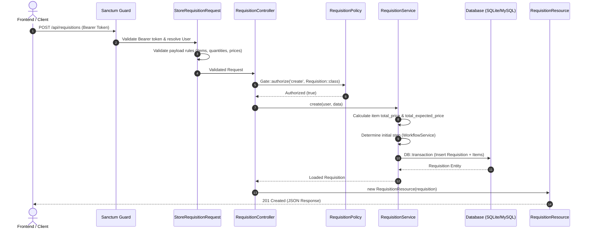

# 01 — Architecture & System Design

This document outlines the architectural patterns, structural design, and request-response lifecycle of the Requisition Management System API.

---

## 1. Architectural Philosophy

The application follows **Clean Architecture** and **SOLID** design principles. The primary goals are:
- **Separation of Concerns**: HTTP transport, validation, business logic, persistence, and serialization are separated into distinct, testable layers.
- **Thin Controllers, Rich Domain Services**: Controllers only orchestrate HTTP requests, authorization checks, and responses. All domain calculations, multi-model state updates, and transaction boundaries live in dedicated Service classes.
- **Strict Authorization via Policies**: Every mutating action or data retrieval passes through Laravel Gate/Policy authorization before executing domain logic.
- **Deterministic API Responses**: All responses are formatted via Laravel API Resource transformations (`JsonResource`), preventing leaking sensitive model fields and ensuring backwards-compatible JSON contracts.

---

## 2. Layered Architecture

```
┌────────────────────────────────────────────────────────────────────────┐
│                        HTTP Client (Web / Mobile)                      │
└────────────────────────────────────┬───────────────────────────────────┘
                                     │ Bearer Token / JSON Request
                                     ▼
┌────────────────────────────────────────────────────────────────────────┐
│                   Authentication Guard (Sanctum)                       │
│    Validates personal access tokens & resolves authenticated User      │
└────────────────────────────────────┬───────────────────────────────────┘
                                     │
                                     ▼
┌────────────────────────────────────────────────────────────────────────┐
│                        Form Request Validation                         │
│  (StoreRequisitionRequest, UpdateUserRequest, StoreApprovalStepRequest)│
└────────────────────────────────────┬───────────────────────────────────┘
                                     │
                                     ▼
┌────────────────────────────────────────────────────────────────────────┐
│                          Controller Layer                              │
│   • RequisitionController, UserController, ApprovalStepController...   │
│   • Enforces Policy Authorization (Gate::authorize)                    │
└────────────────────────────────────┬───────────────────────────────────┘
                                     │
                                     ▼
┌────────────────────────────────────────────────────────────────────────┐
│                        Domain Service Layer                            │
│   • RequisitionService: Item calculations & transactional persistence  │
│   • WorkflowService: Approval chain transitions & step resolution      │
│   • SettingsService: Singleton config cache & approver resolution      │
│   • AuthService: Credential check & token lifecycle                    │
│   • RequisitionNumberService: Auto-generating unique formatted codes   │
└────────────────────────────────────┬───────────────────────────────────┘
                                     │
                                     ▼
┌────────────────────────────────────────────────────────────────────────┐
│                      Data Layer (Eloquent ORM)                         │
│   • Models: User, Requisition, RequisitionItem, ApprovalStep, Settings │
│   • Relational Database (MySQL / PostgreSQL / SQLite)                  │
└────────────────────────────────────┬───────────────────────────────────┘
                                     │
                                     ▼
┌────────────────────────────────────────────────────────────────────────┐
│                       JSON API Resource Layer                          │
│   • RequisitionResource, UserResource, SystemSettingsResource, etc.    │
└────────────────────────────────────────────────────────────────────────┘
```

---

## 3. Directory Layout & Roles

| Path | Purpose & Responsibility |
| :--- | :--- |
| `app/Enums/` | PHP 8.3 backed string enums defining domain statuses (`UserType`, `RequisitionStatus`, `RequisitionStep`, `DecisionStatus`). |
| `app/Http/Controllers/` | Thin controllers handling HTTP requests, authorizing actions via policies, and delegating to services. |
| `app/Http/Requests/` | Form request classes containing granular input validation rules and custom error messages. |
| `app/Http/Resources/` | Resource transformers converting Eloquent models to predictable JSON representations. |
| `app/Models/` | Eloquent ORM entity models with relations, casting rules, attribute fillables, and soft deletes. |
| `app/Policies/` | Policy classes defining domain security rules for models (`RequisitionPolicy`, `UserPolicy`, `SystemSettingsPolicy`). |
| `app/Services/` | Core domain services encapsulating business logic, calculations, workflow transitions, and caching. |
| `database/migrations/` | Schema migration definitions for all tables, foreign keys, indexes, and soft-delete columns. |
| `database/seeders/` | Initial seeders for development, staging, and demo environments. |
| `tests/Unit/` | Unit test suite testing services and business rules in isolation with mocks. |
| `tests/Feature/` | Integration and HTTP endpoint test suite. |

---

## 4. Key Design Patterns

### 1. Service Layer Pattern
Business logic is decoupled from HTTP controllers into focused service classes:
- **`WorkflowService`**: Implements state-machine like behaviour for multi-tier approvals (`getInitialStep`, `getNextStep`, `approve`, `deny`).
- **`RequisitionService`**: Handles line-item price calculation (`quantity * unit_price`), overall summing, and atomic DB transactions.
- **`SettingsService`**: Provides cached access (`Cache::remember`) to global approver assignments.
- **`RequisitionNumberService`**: Generates sequential formatted reference numbers (e.g., `REQ-2026-0001`).

### 2. Database Transaction Boundary
All state mutating operations spanning multiple tables are wrapped inside `DB::transaction(...)` blocks. For example:
- Creating a requisition + inserting line items.
- Approving/denying a requisition + inserting the `ApprovalStep` audit record + advancing `current_step`.

### 3. Policy-Based Authorization
Controllers never hardcode role checks in their methods. Instead, they invoke:
```php
Gate::authorize('approve', $requisition);
```
The policy evaluates whether the authenticated user is currently assigned as the approver for that specific step (`APPROVER_1`, `APPROVER_2`, `BUSINESS_CONTROLLER`, `ACCOUNTS`, `HR_ADMIN`).

---

## 5. Request-Response Lifecycle Example


