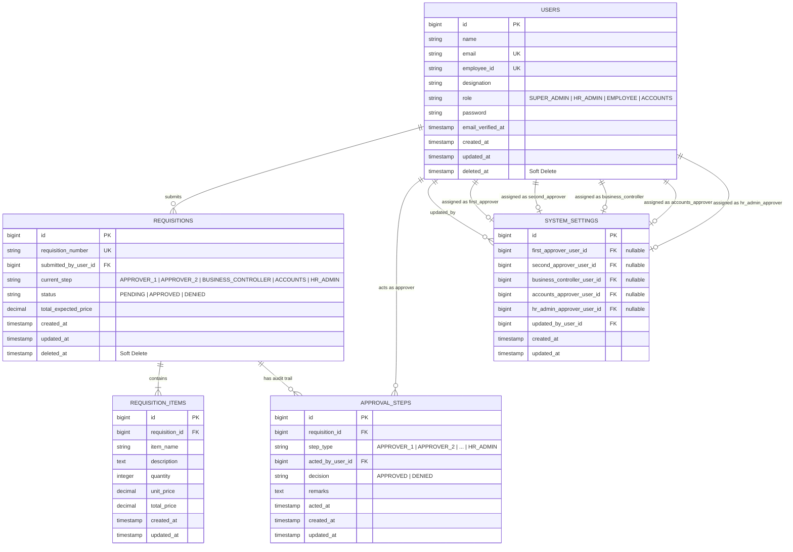

# 02 — Domain Model & Database Architecture

This document describes the data models, database schema, entity relationships, Enums, and casting strategies in the Requisition Management System.

---

## 1. Entity-Relationship Diagram (ERD)

---

## 2. Domain Enums

The application utilizes native PHP 8.3 backed string enums to enforce domain validity.

### `UserType` (`App\Enums\UserType`)
Defines the high-level role classification for accounts:
- `SUPER_ADMIN`: Full administrative power (manages approvers, users, settings).
- `HR_ADMIN`: Employee manager, can create/edit users and acts as the final approval step.
- `ACCOUNTS`: Financial auditing role.
- `EMPLOYEE`: Standard organizational member.

### `RequisitionStatus` (`App\Enums\RequisitionStatus`)
Defines the macro state of a requisition:
- `PENDING`: In flight, currently awaiting action at an approval step.
- `APPROVED`: Requisition has completed all required stages successfully.
- `DENIED`: Requisition was rejected at an approval step.

### `RequisitionStep` (`App\Enums\RequisitionStep`)
Defines the sequential stages of the approval chain:
- `APPROVER_1`: First Approver (e.g. Project Manager / Team Lead).
- `APPROVER_2`: Second Approver (e.g. Managing Director / CEO).
- `BUSINESS_CONTROLLER`: Business / Financial Controller.
- `ACCOUNTS`: Accounts verification.
- `HR_ADMIN`: Final HR verification and closure.

### `DecisionStatus` (`App\Enums\DecisionStatus`)
Records the explicit decision made on an audit step:
- `APPROVED`: The step was approved and progressed.
- `DENIED`: The step was denied and workflow terminated.

---

## 3. Eloquent Models & Relationships

### `User` (`App\Models\User`)
- **Traits**: `HasApiTokens`, `HasFactory`, `Notifiable`, `SoftDeletes`
- **Relationships**:
  - `submittedRequisitions()`: `hasMany(Requisition::class, 'submitted_by_user_id')`
  - `approvalSteps()`: `hasMany(ApprovalStep::class, 'acted_by_user_id')`
- **Casts**: `role => UserType::class`, `password => hashed`

### `Requisition` (`App\Models\Requisition`)
- **Traits**: `HasFactory`, `SoftDeletes`
- **Relationships**:
  - `submittedBy()`: `belongsTo(User::class, 'submitted_by_user_id')`
  - `items()`: `hasMany(RequisitionItem::class)`
  - `approvals()`: `hasMany(ApprovalStep::class)`
- **Casts**: `current_step => RequisitionStep::class`, `status => RequisitionStatus::class`, `total_expected_price => decimal:2`

### `RequisitionItem` (`App\Models\RequisitionItem`)
- **Traits**: `HasFactory`
- **Relationships**:
  - `requisition()`: `belongsTo(Requisition::class)`
- **Casts**: `unit_price => decimal:2`, `total_price => decimal:2`, `quantity => integer`

### `ApprovalStep` (`App\Models\ApprovalStep`)
- **Traits**: `HasFactory`
- **Relationships**:
  - `requisition()`: `belongsTo(Requisition::class)`
  - `actedBy()`: `belongsTo(User::class, 'acted_by_user_id')`
- **Casts**: `step_type => RequisitionStep::class`, `decision => DecisionStatus::class`, `acted_at => datetime`

### `SystemSettings` (`App\Models\SystemSettings`)
- **Traits**: `HasFactory`
- **Relationships**:
  - `firstApprover()`: `belongsTo(User::class, 'first_approver_user_id')`
  - `secondApprover()`: `belongsTo(User::class, 'second_approver_user_id')`
  - `businessController()`: `belongsTo(User::class, 'business_controller_user_id')`
  - `accountsApprover()`: `belongsTo(User::class, 'accounts_approver_user_id')`
  - `hrAdminApprover()`: `belongsTo(User::class, 'hr_admin_approver_user_id')`
  - `updatedBy()`: `belongsTo(User::class, 'updated_by_user_id')`

---

## 4. Database Optimization & Integrity

1. **Foreign Keys with Cascade Deletion**:
   - `requisition_items` and `approval_steps` are automatically cleaned up if their parent `requisitions` record is hard deleted.
   - `system_settings` approver user IDs use `ON DELETE SET NULL` to preserve settings integrity if a user account is removed.
2. **Soft Deletes**:
   - Both `users` and `requisitions` utilize Laravel `SoftDeletes`, preserving historical audit trails while hiding deleted entries from normal queries.
3. **Sequential Requisition Numbers**:
   - Requisition numbers follow the pattern `REQ-{YYYY}-{XXXX}` (e.g. `REQ-2026-0001`) and are strictly indexed and unique.
