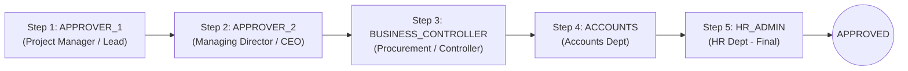
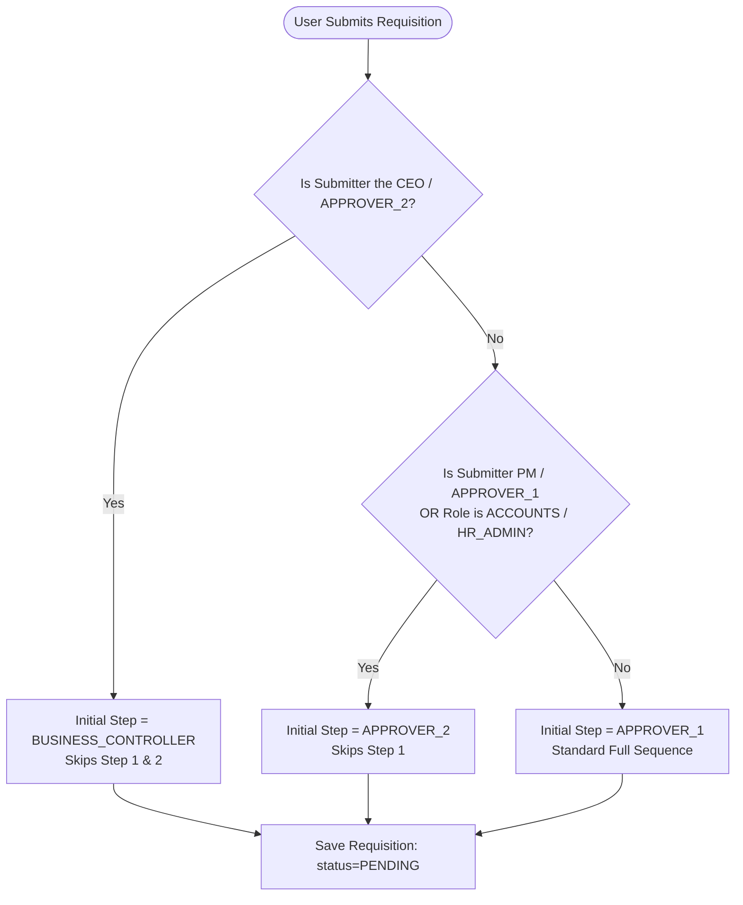
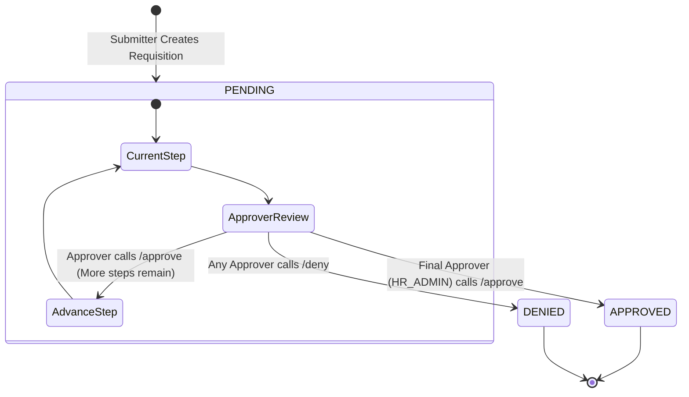

# 04 — Requisition & Approval Workflow

This document explains the approval workflow engine implemented in [`WorkflowService`](file:///home/zero/Documents/pc/requisition-api/app/Services/WorkflowService.php), detailing step sequences, dynamic routing, decision handling, and audit trails.

---

## 1. Approval Steps Hierarchy & Standard Sequence

The workflow is organized into a 5-step sequential approval chain:

| Step | Enum Value | Default Organizational Role | Responsibilities |
| :--- | :--- | :--- | :--- |
| **Step 1** | `APPROVER_1` | Project Manager / Team Lead | Initial departmental necessity check and operational validation. |
| **Step 2** | `APPROVER_2` | CEO / Managing Director | Executive authorization and organizational alignment. |
| **Step 3** | `BUSINESS_CONTROLLER` | Business & Financial Controller | Budget allocation check, price sanity, procurement vetting. |
| **Step 4** | `ACCOUNTS` | Accounts Department | Financial accounts verification and payment preparation. |
| **Step 5** | `HR_ADMIN` | HR Administration | Final organizational verification, asset tagging, and lifecycle completion. |

---

## 2. Dynamic Initial Step Determination

When a user creates a requisition via `POST /api/requisitions`, the system avoids redundant self-approvals by evaluating the submitter's role and designated approver status through [`WorkflowService::getInitialStep()`](file:///home/zero/Documents/pc/requisition-api/app/Services/WorkflowService.php#L19):

### Summary of Starting Steps:
1. **Submitter is CEO (`APPROVER_2`)**: Starts directly at `BUSINESS_CONTROLLER` (skips Approver 1 & Approver 2).
2. **Submitter is PM (`APPROVER_1`) OR `ACCOUNTS` OR `HR_ADMIN`**: Starts at `APPROVER_2` (skips Approver 1).
3. **Regular `EMPLOYEE`**: Starts at `APPROVER_1` (standard 5-step lifecycle).

---

## 3. Decision Actions & State Transitions

### 3.1 Approving a Requisition (`POST /api/requisitions/{id}/approve`)
1. **Authorization Check**: `RequisitionPolicy::approve` verifies that:
   - Requisition status is `PENDING`.
   - The authenticated user's ID matches the configured user ID for `requisition.current_step` in `SystemSettings`.
2. **Audit Step Created**: An `ApprovalStep` record is created inside a database transaction:
   - `step_type`: Current step (e.g. `APPROVER_1`).
   - `acted_by_user_id`: Authenticated approver's ID.
   - `decision`: `APPROVED`.
   - `remarks`: Optional reviewer comments.
   - `acted_at`: Current timestamp (`now()`).
3. **Advance or Complete**:
   - If a subsequent step exists in `getNextStep()`, `requisition.current_step` is updated to the next step.
   - If the current step was the final step (`HR_ADMIN`), `requisition.status` is set to `APPROVED` and `requisition.current_step` is set to `null`.

### 3.2 Denying a Requisition (`POST /api/requisitions/{id}/deny`)
1. **Authorization Check**: Same policy verification as approval.
2. **Audit Step Created**: An `ApprovalStep` record is created:
   - `step_type`: Current step.
   - `acted_by_user_id`: Authenticated approver's ID.
   - `decision`: `DENIED`.
   - `remarks`: Reviewer comments explaining denial.
   - `acted_at`: Current timestamp (`now()`).
3. **Halt Workflow**:
   - `requisition.status` is updated to `DENIED`.
   - `requisition.current_step` is set to `null`.
   - The workflow immediately terminates.

---

## 4. Requisition Modification Rules

To guarantee financial and audit integrity:
- **Updating Items (`PUT /api/requisitions/{id}`)**:
  - Can only be performed by the original submitter.
  - Allowed **only before any approvals have occurred** (`approvals()->count() === 0`).
  - Total expected price and line item prices are automatically recomputed.
- **Deleting Requisitions (`DELETE /api/requisitions/{id}`)**:
  - Can only be performed by the original submitter.
  - Allowed **only while status is still `PENDING`**.
  - Uses soft-deletes (`deleted_at`).
