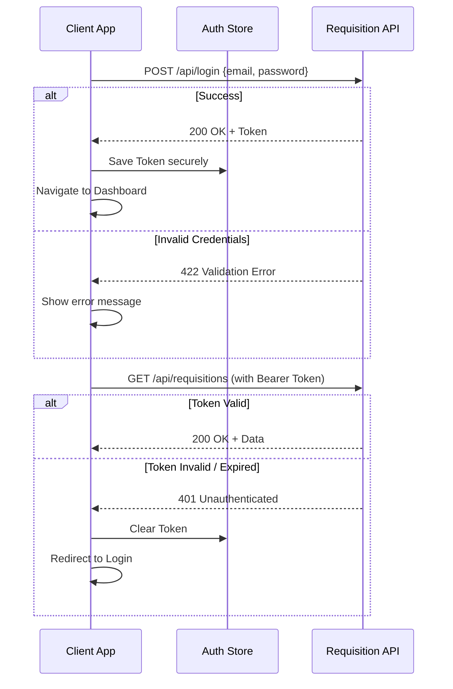
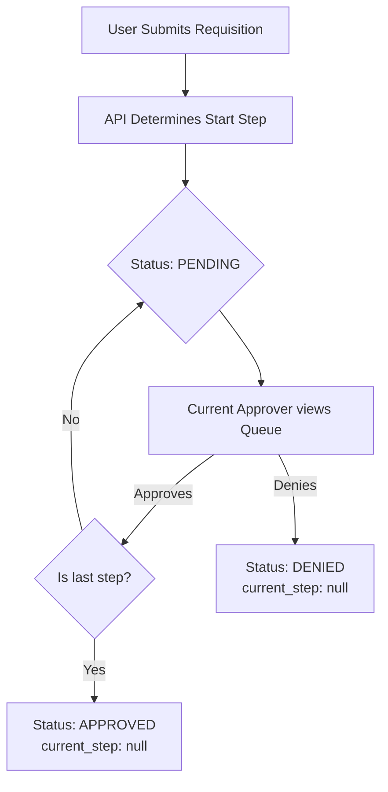

# Client Integration Guide

This comprehensive guide is designed for frontend developers building mobile (React Native, Flutter, Swift, Kotlin) and web (React, Vue, Angular) applications that connect to the Requisition Management API.

---

## 1. Getting Started

### Base URL
- **Development Environment:** `http://127.0.0.1:8000`
- **Production Environment:** *Configurable via your application's environment settings.*

### Headers
Every request to the API must include the following headers:
```http
Accept: application/json
Content-Type: application/json
```

For authenticated endpoints, you must also include the bearer token:
```http
Authorization: Bearer <your_access_token>
```

---

## 2. Authentication Flow

The API uses Laravel Sanctum for authentication. Tokens are non-expiring personal access tokens that remain valid until revoked via the logout endpoint.

### Login
Send credentials to receive a token.
- **Endpoint:** `POST /api/login`
- **Request Body:** `{"email": "user@example.com", "password": "password"}`
- **Response:** Contains `access_token`, `token_type`, `message`, and the `user` object.

### Token Storage Guidelines
- **Web Applications:** If you must use `localStorage`, be aware of XSS risks. Prefer HTTP-only cookies if the API supports it in the future, or implement short-lived tokens.
- **Mobile Applications:** Always use secure storage mechanisms like `SecureStorage` (React Native), `Keychain` (iOS), or `EncryptedSharedPreferences` (Android).

### Get Current User
Fetch the authenticated user's details.
- **Endpoint:** `GET /api/user`

### Logout
Revoke the current token.
- **Endpoint:** `POST /api/logout`

### Handling 401 Responses
If any API request returns a `401 Unauthenticated` status code, your application should immediately:
1. Clear the stored token.
2. Redirect the user to the login screen.

### Authentication Sequence Diagram



---

## 3. Role-Based UI Guidance

The API is structured around four distinct roles. You should control UI visibility based on the authenticated user's `role`.

| Feature / Screen | SUPER_ADMIN | HR_ADMIN | ACCOUNTS | EMPLOYEE |
| :--- | :---: | :---: | :---: | :---: |
| **System Settings** | ✅ | ❌ | ❌ | ❌ |
| **User Management** | ✅ | ✅ | ❌ | ❌ |
| **All Requisitions (Read-only)** | ✅ | ❌ | ❌ | ❌ |
| **Deleted Requisitions (`?trashed=only`)** | ✅ | ❌ | ❌ | ❌ |
| **Submit Requisition** | ❌ | ✅ | ✅ | ✅ |
| **Own Requisitions** | ❌ | ✅ | ✅ | ✅ |
| **Approval Queue** | ❌ | ✅ | ✅ | ❌ |

> [!NOTE] 
> The `SUPER_ADMIN` has a global view of all requisitions but does not participate in the approval workflow or submit their own requisitions.

---

## 4. Complete Endpoint Reference

### Authentication

#### Login
- **Method & URL:** `POST /api/login`
- **Auth Required:** No
- **Request Body:**
  ```json
  {
    "email": "string (required, valid email)",
    "password": "string (required)"
  }
  ```
- **Response (200 OK):**
  ```json
  {
    "message": "Login successful",
    "access_token": "1|token...",
    "token_type": "Bearer",
    "user": {
      "id": 1,
      "name": "Admin User",
      "email": "admin@example.com",
      "employee_id": "EMP-001",
      "designation": "Manager",
      "role": "SUPER_ADMIN",
      "created_at": "2023-10-27T10:00:00.000000Z",
      "updated_at": "2023-10-27T10:00:00.000000Z"
    }
  }
  ```

#### Get User
- **Method & URL:** `GET /api/user`
- **Auth Required:** Yes
- **Response (200 OK):**
  ```json
  {
    "data": {
      "id": 1,
      "name": "Admin User",
      "email": "admin@example.com",
      "employee_id": "EMP-001",
      "designation": "Manager",
      "role": "SUPER_ADMIN",
      "created_at": "2023-10-27...",
      "updated_at": "2023-10-27..."
    }
  }
  ```

#### Logout
- **Method & URL:** `POST /api/logout`
- **Auth Required:** Yes
- **Response (200 OK):**
  ```json
  {
    "message": "Successfully logged out"
  }
  ```

### Users (SUPER_ADMIN, HR_ADMIN only)

#### List Users
- **Method & URL:** `GET /api/users`
- **Query Params:** `page`, `per_page`, `role`, `search`
- **Auth Required:** Yes (Role check applies)
- **Response:** Standard Paginated Response (see Section 5).

#### Create User
- **Method & URL:** `POST /api/users`
- **Auth Required:** Yes
- **Request Body:**
  ```json
  {
    "name": "string (required, max 255)",
    "email": "string (required, valid email, unique)",
    "password": "string (required, min 8)",
    "employee_id": "string (required, unique)",
    "designation": "string (required)",
    "role": "string (required, enum: SUPER_ADMIN, HR_ADMIN, ACCOUNTS, EMPLOYEE)"
  }
  ```
- **Response (201 Created):** Full User JSON object.

#### Get User Details
- **Method & URL:** `GET /api/users/{id}`
- **Auth Required:** Yes (Also accessible by self)
- **Response (200 OK):** Full User JSON object.

#### Update User
- **Method & URL:** `PUT /api/users/{id}`
- **Auth Required:** Yes
- **Request Body:** All fields optional (uses validation `sometimes`).
- **Response (200 OK):** Updated User JSON object.

#### Delete User
- **Method & URL:** `DELETE /api/users/{id}`
- **Auth Required:** Yes (SUPER_ADMIN only, cannot delete self)
- **Response (200 OK):** `{"message": "User deleted successfully"}`

### Settings (SUPER_ADMIN only)

#### Get Workflow Settings
- **Method & URL:** `GET /api/settings`
- **Auth Required:** Yes
- **Response (200 OK):**
  ```json
  {
    "first_approver": { "id": 2, "name": "...", "email": "...", "employee_id": "...", "designation": "..." },
    "second_approver": { "id": 3, "name": "...", "email": "...", "employee_id": "...", "designation": "..." },
    "business_controller": null,
    "accounts_approver": { "id": 5, "name": "...", "email": "...", "employee_id": "...", "designation": "..." },
    "hr_admin_approver": { "id": 6, "name": "...", "email": "...", "employee_id": "...", "designation": "..." }
  }
  ```

#### Update Workflow Settings
- **Method & URL:** `PUT /api/settings`
- **Auth Required:** Yes
- **Request Body:**
  ```json
  {
    "first_approver_user_id": "integer|nullable (must exist in users)",
    "second_approver_user_id": "integer|nullable (must exist in users)",
    "business_controller_user_id": "integer|nullable (must exist in users)",
    "accounts_approver_user_id": "integer|nullable (must exist in users)",
    "hr_admin_approver_user_id": "integer|nullable (must exist in users)"
  }
  ```

### Requisitions

#### List Requisitions
- **Method & URL:** `GET /api/requisitions`
- **Query Params:** `status` (PENDING, APPROVED, DENIED), `approval=mine` (only requisitions you approved/denied), `submitted=mine` (only requisitions you submitted), `trashed=only` (SUPER_ADMIN only: list soft-deleted requisitions), `page`, `per_page`
- **Auth Required:** Yes (Auto-scoped by role)
- **Response:** Standard Paginated Response of Requisitions (with nested `submitted_by`, `items[]`, `approvals[]`).

#### Create Requisition
- **Method & URL:** `POST /api/requisitions`
- **Auth Required:** Yes
- **Request Body:**
  ```json
  {
    "items": [
      {
        "item_name": "string (required)",
        "description": "string (required)",
        "quantity": "integer (required, min 1)",
        "unit_price": "numeric (required, min 0)"
      }
    ]
  }
  ```
  *(Note: Server calculates `total_price` per item and `total_expected_price`)*
- **Response (201 Created):** Full Requisition object.

#### Get Requisition Details
- **Method & URL:** `GET /api/requisitions/{id}`
- **Auth Required:** Yes (Submitter, current approver, any user who already approved/denied it, or Super Admin)
- **Response (200 OK):** Full detail with `items` and approval audit trail.

#### Update Requisition
- **Method & URL:** `PUT /api/requisitions/{id}`
- **Auth Required:** Yes (Submitter only, before any approvals)
- **Request Body:** Same shape as Create.
- **Response (200 OK):** Updated Requisition object.

#### Delete Requisition
- **Method & URL:** `DELETE /api/requisitions/{id}`
- **Auth Required:** Yes (Submitter only, while PENDING)
- **Response (200 OK):** `{"message": "Requisition deleted successfully"}`

### Approval Actions

#### Approve Requisition Step
- **Method & URL:** `POST /api/requisitions/{id}/approve`
- **Auth Required:** Yes (Only designated approver for the current step)
- **Request Body:**
  ```json
  {
    "remarks": "string (optional, max 1000)"
  }
  ```
- **Response (200 OK):** Returns the updated requisition with advanced `current_step` (or `status: "APPROVED"` and `current_step: null` if final step).

#### Deny Requisition
- **Method & URL:** `POST /api/requisitions/{id}/deny`
- **Auth Required:** Yes (Only designated approver for the current step)
- **Request Body:**
  ```json
  {
    "reason": "string (required, max 1000)" 
  }
  ```
  *(Note: Also accepts `remarks` for backward compatibility, but `reason` or `remarks` is mandatory)*
- **Response (200 OK):** Returns the updated requisition with `status: "DENIED"` and `current_step: null`.

---

## 5. Pagination

The API uses standard Laravel pagination for endpoints that return collections (e.g., users, requisitions).

### Response Structure
```json
{
  "data": [
    // Array of objects
  ],
  "links": {
    "first": "http://api.example.com/api/requisitions?page=1",
    "last": "http://api.example.com/api/requisitions?page=3",
    "prev": null,
    "next": "http://api.example.com/api/requisitions?page=2"
  },
  "meta": {
    "current_page": 1,
    "from": 1,
    "last_page": 3,
    "links": [
      { "url": null, "label": "&laquo; Previous", "active": false },
      { "url": "http://api.example.com/api/requisitions?page=1", "label": "1", "active": true }
    ],
    "path": "http://api.example.com/api/requisitions",
    "per_page": 15,
    "to": 15,
    "total": 42
  }
}
```

### Implementation Tips
- **Infinite Scroll:** Append the new items from `data` to your existing list. Check if `links.next` is `null` to know when to stop fetching.
- **Traditional Pagination:** Render page buttons using the items in `meta.links`, handling the active states and URLs.

---

## 6. Error Handling

### Common Error Responses

- **401 Unauthenticated**
  ```json
  {
    "message": "Unauthenticated."
  }
  ```
- **403 Forbidden** (When a user tries to approve a step they don't own)
  ```json
  {
    "message": "This action is unauthorized."
  }
  ```
- **404 Not Found**
  ```json
  {
    "message": "No query results for model [App\\Models\\Requisition] 999."
  }
  ```
- **422 Validation Error**
  ```json
  {
    "message": "The given data was invalid.",
    "errors": {
      "item_name": ["The item name field is required."]
    }
  }
  ```
- **422 Login Failed**
  ```json
  {
    "message": "The provided credentials are incorrect.",
    "errors": {
      "email": ["These credentials do not match our records."]
    }
  }
  ```

### Reusable Error Handler Example (TypeScript/Axios)
```typescript
import axios, { AxiosError } from 'axios';

interface ApiErrorResponse {
  message: string;
  errors?: Record<string, string[]>;
}

export function handleApiError(error: unknown) {
  if (axios.isAxiosError(error)) {
    const axiosError = error as AxiosError<ApiErrorResponse>;
    const status = axiosError.response?.status;
    const data = axiosError.response?.data;

    switch (status) {
      case 401:
        // Clear token, redirect to login
        authStore.logout();
        break;
      case 403:
        alert("You do not have permission to perform this action.");
        break;
      case 404:
        alert("The requested resource was not found.");
        break;
      case 422:
        if (data?.errors) {
          // Process validation errors, perhaps bind them to a form UI
          console.error("Validation failed:", data.errors);
        } else {
          alert(data?.message || "Validation failed.");
        }
        break;
      default:
        alert("An unexpected error occurred. Please try again.");
    }
  } else {
    console.error("Non-HTTP error:", error);
  }
}
```

---

## 7. Workflow Integration Guide

The system uses a dynamic 5-tier approval chain: `APPROVER_1` → `APPROVER_2` → `BUSINESS_CONTROLLER` → `ACCOUNTS` → `HR_ADMIN`.

### Client-Side Workflow Perspective



### Determining UI Actions
The API fully handles authorization. The client just needs to render the right UI based on state.

1. **State Values:**
   - `status`: `PENDING`, `APPROVED`, `DENIED`
   - `current_step`: `APPROVER_1`, `APPROVER_2`, `BUSINESS_CONTROLLER`, `ACCOUNTS`, `HR_ADMIN`, or `null`

2. **When `current_step` is `null`:** 
   This indicates the workflow is complete. It is either fully `APPROVED` or it was `DENIED` somewhere along the chain.

3. **Showing Action Buttons:**
   Instead of trying to calculate if the user can approve on the client side, look at the `requisitions` they receive in their "Approval Queue" (which is server-scoped). For items in their queue where `status === 'PENDING'`, show the **Approve** and **Deny** buttons. If they attempt an invalid action, they will receive a `403` which your global error handler will catch.

---

## 8. Email Notifications

The API automatically queues and sends emails based on workflow events. **No client-side implementation is required** for these, but you may want to surface this behavior in the UI (e.g., "The next approver has been notified").

1. **Pending Approval Email:** Sent to the designated approver of the *next* step when a requisition is submitted or progresses.
2. **Step Approved Email:** Sent to the submitter when their requisition clears a step, indicating if it's fully approved or pending further review.
3. **Denial Email:** Sent to the submitter if a requisition is denied, containing the mandatory reason provided by the approver.

---

## 9. Quick Reference: Status Codes

| Endpoint | Method | Success | Client Error (4xx) | Auth Error (401/403) |
| :--- | :---: | :---: | :---: | :---: |
| `/api/login` | POST | 200 | 422 | N/A |
| `/api/logout` | POST | 200 | N/A | 401 |
| `/api/user` | GET | 200 | N/A | 401 |
| `/api/users` | GET/POST | 200/201 | 422 | 401, 403 |
| `/api/users/{id}` | GET/PUT/DEL | 200 | 404, 422 | 401, 403 |
| `/api/settings` | GET/PUT | 200 | 422 | 401, 403 |
| `/api/requisitions` | GET/POST | 200/201 | 422 | 401 |
| `/api/requisitions/{id}` | GET/PUT/DEL | 200 | 404, 422 | 401, 403 |
| `/api/requisitions/{id}/approve` | POST | 200 | 404 | 401, 403 |
| `/api/requisitions/{id}/deny` | POST | 200 | 404, 422 | 401, 403 |

